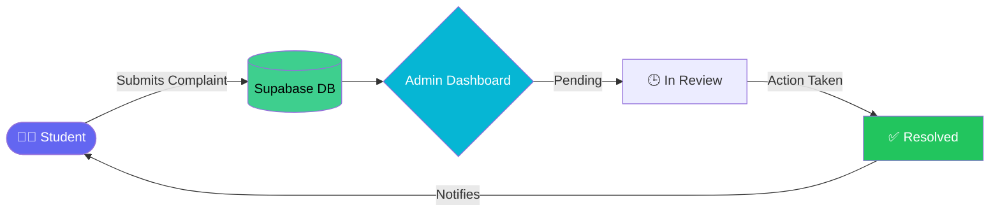

<div align="center">

<!-- Animated top banner -->


<!-- Animated typing tagline -->
<a href="#">
  
</a>

<br/>

<!-- Badges -->
<p>
  
  
  
  
  
</p>

<p>
  
  
  
  
</p>

</div>

---

### 📌 About

**Student Complaint Management System** is a full digital grievance-redressal platform built for colleges and universities. It replaces slow, paper-based complaint registers with a fast, transparent web app — students raise issues online, admins/staff track and resolve them in real time, and everyone can follow the status without a single physical form.

> *"It's been good to resolve all complaints in a digital way — to nullify paperwork."*

<div align="center">

</div>

---

### ✨ Features

<table>
<tr>
<td width="50%" valign="top">

**🎓 For Students**
- 📝 Submit complaints with category & description
- 📍 Real-time status tracking (Pending → In Progress → Resolved)
- 🔔 Instant updates on complaint progress
- 🔐 Secure authentication via Supabase

</td>
<td width="50%" valign="top">

**🛠️ For Admins**
- 📊 Centralized dashboard for all complaints
- ✅ Update status & respond to students
- 🔎 Filter and search complaints by category/status
- 📈 Clean, data-driven overview — zero paperwork

</td>
</tr>
</table>

---

### 🧰 Tech Stack

<div align="center">

     

</div>

| Layer | Technology |
|---|---|
| Frontend | React 18 + TypeScript |
| Build Tool | Vite |
| Styling | Tailwind CSS |
| Icons | Lucide React |
| Backend / Auth / DB | Supabase |
| Linting | ESLint + typescript-eslint |

---

### ⚡ Getting Started

<details open>
<summary><b>Click to expand setup instructions</b></summary>

```bash
# 1. Clone the repository
git clone https://github.com/aarammaurya836-lab/student-complaint-management-system-.git

# 2. Move into the project folder
cd student-complaint-management-system-

# 3. Install dependencies
npm install

# 4. Set up environment variables
# Create a .env file in the root with your Supabase credentials:
# VITE_SUPABASE_URL=your_supabase_url
# VITE_SUPABASE_ANON_KEY=your_supabase_anon_key

# 5. Run the development server
npm run dev

# 6. Build for production
npm run build
```

</details>

---

### 📁 Project Structure

```
student-complaint-management-system-/
├── src/              # Application source code
├── dist/             # Production build output
├── index.html        # Entry HTML
├── tailwind.config.js
├── vite.config.ts
├── tsconfig.json
└── package.json
```

---

### 🗺️ Workflow



---

### 🤝 Contributing

Contributions are welcome! Feel free to fork this repo, create a feature branch, and open a pull request.

```bash
git checkout -b feature/your-feature-name
git commit -m "Add: your feature"
git push origin feature/your-feature-name
```

---

### 📄 License

This project is open-source and available under the [MIT License](LICENSE).

---

<div align="center">

### 💬 Let's Connect

<a href="https://github.com/aarammaurya836-lab"></a>

⭐ **If this project helped you, consider giving it a star!** ⭐


</div>
